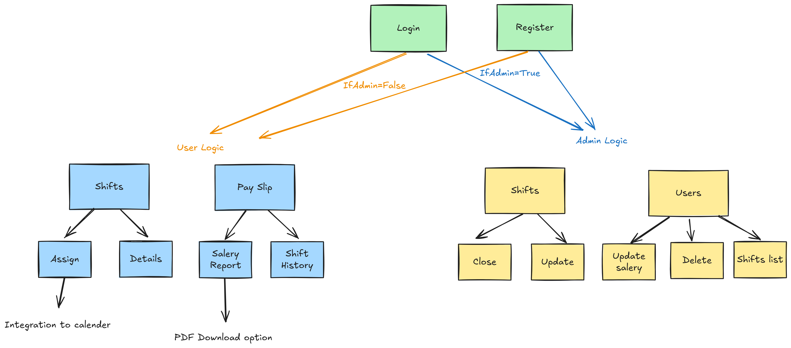
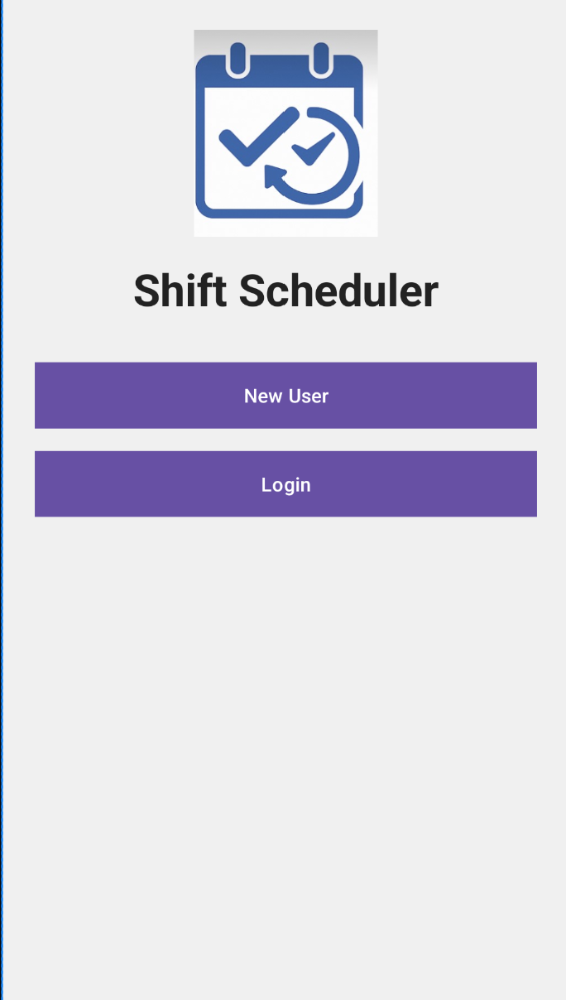
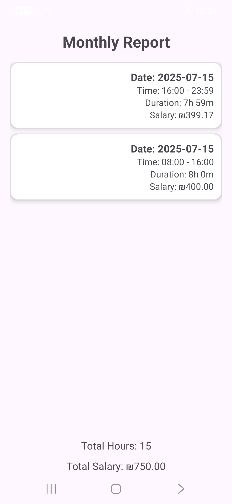
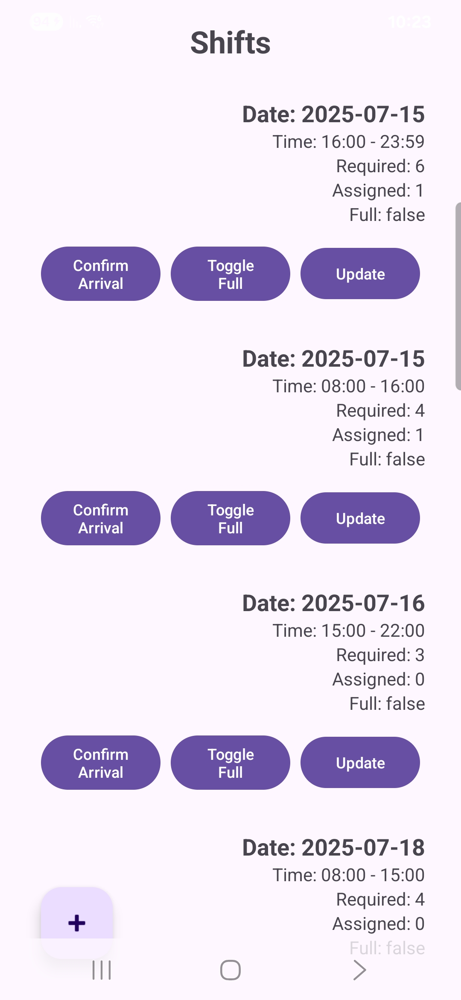
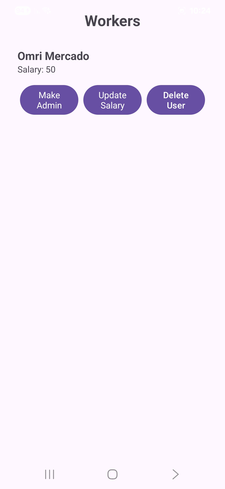
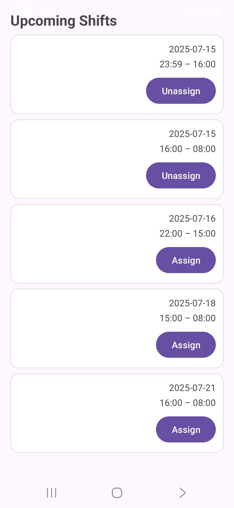

# ShiftScheduler

An Android app for managers to create and confirm work shifts, and for employees to claim, track and report their hours. Built in **Java**, with **Firebase Auth (email/password)** and **Cloud Firestore**.

---
## 📊 Project Logic



Below is a high-level view of how users move through the app, and what each dashboard exposes:

1. **Login / Register**  
   - On success you check `users/{uid}.admin`  
     - **If admin →** Admin Dashboard  
     - **If non-admin →** Worker Dashboard  

2. **Worker Dashboard**  
   - **Upcoming Shifts**  
     - Assign / Unassign  
     - View shift details (date, time)  
   - **Pay Slip**  
     - Shift history  
     - Salary report  

3. **Admin Dashboard**  
   - **Shifts**  
     - Close  
     - Update  
   - **Users**  
     - Update salary  
     - Delete user  
     - View shifts list  
---

## 📋 Table of Contents

1. [Features](#-features)  
2. [Tech Stack](#-tech-stack)  
3. [Prerequisites](#-prerequisites)  
4. [Setup & Installation](#-setup--installation)  
5. [Firebase Configuration](#-firebase-configuration)  
6. [Usage](#-usage)  
7. [Screenshots](#-screenshots)  
8. [Contributing](#-contributing)  
9. [License](#-license)  

---

## 🚀 Features

### Admin
- **User Management**: View all users and grant/remove admin privileges  
- **Shift Management**: Create, update, mark “full” when enough staff assigned  
- **Arrival Confirmation**: Mark which assigned employees showed up  

### Worker
- **Upcoming Shifts**: Browse only future shifts, Assign/Unassign yourselves  
- **Calendar Integration**: “Assign” automatically inserts event into device calendar  
- **Monthly Report**: View all completed shifts this month, with total hours & earnings  

---

## 🛠️ Tech Stack

- **Language**: Java  
- **UI**: AndroidX 
- **Auth & Data**: Firebase Authentication (Email/Password), Cloud Firestore  
- **Calendar**: Android `CalendarContract` Intent  

---

## 🔧 Prerequisites

- Android Studio Flamingo or newer  
- JDK 11+  
- A Firebase project configured with:  
  - **Authentication**: enable Email/Password sign-in  
  - **Cloud Firestore**: in production or test mode  
- Downloaded `google-services.json` (no SHA1 required unless you later add Google sign-in)  

---

## ⚙️ Setup & Installation

1. **Clone the repo**  
   ```bash
   git clone https://github.com/YourUsername/ShiftScheduler.git
   cd ShiftScheduler
   ```bash

2.**Place Firebase config**
    -Copy your google-services.json into app/

3. **Open in Android Studio**
    -File → Open → project root
    -Let Gradle sync, then run on an emulator or device

---

## 🔑 Firebase Configuration

### Firestore Collections

#### `users/{uid}`

| Field         | Type      | Description                 |
|---------------|-----------|-----------------------------|
| `email`       | string    | User’s email address        |
| `name`        | string    | Full name                   |
| `dateOfBirth` | string    | e.g. `"1990-01-31"`         |
| `admin`       | boolean   | `true` = manager            |
| `salary`      | number    | Hourly wage (₪)             |
| `createdAt`   | timestamp | Account creation timestamp  |

#### `shifts/{shiftId}`

| Field               | Type        | Description                          |
|---------------------|-------------|--------------------------------------|
| `date`              | timestamp   | Shift date                           |
| `start_time`        | string      | e.g. `"08:00"`                       |
| `end_time`          | string      | e.g. `"16:00"`                       |
| `requiredEmployees` | number      | Staff needed                         |
| `fullShift`         | boolean     | `true` if at capacity                |
| `users` _(array)_   | map objects | Each entry: `{ email, name, arrived }` |

---

## 📱 Usage

1. **Welcome** → Choose **Register** or **Login**  
2. **Register**  
   - Fill in **Name**, **Email**, **Password** & **DOB**  
3. **Login**  
   - Email/password only  
   - Checks `users/{uid}.admin` → routes to **Admin** or **Worker** dashboard  
4. **Worker Dashboard**  
   - **Upcoming Shifts** list  
   - **Assign** → adds your `{ email, name, arrived:false }` to shift, creates calendar event  
   - **Unassign** → removes you & your calendar event  
   - **Monthly Report** shows past completed shifts + totals  
5. **Admin Dashboard**  
   - **Manage Users** (toggle admin flag)  
   - **Manage Shifts** (create/update/toggle full)  
   - **Confirm Arrivals** for each shift  

---
## 📸 Screenshots
<p float="left">   </p>

